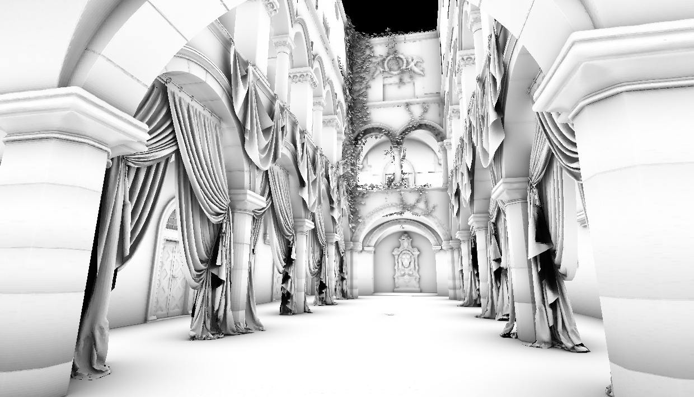

# Ambient Occlusion using Spatial Hashing for Architectural Visualization

This repository contains the practical part of my bachelor thesis on "Ambient Occlusion using Spatial Hashing for Architectural Visualization".

## Abstract

In the field of architectural visualization, there is a need to create interactive and accessible renderings of 3D architectural models. One method that lends itself to this type of visualization is ambient occlusion.

Ambient occlusion is a technique for creating soft shading for a scene without the use of any light sources, but by using geometry information about open spaces within a scene instead. 

This thesis first provides an overview of the basic principle of ambient occlusion and then reviews the methods used to implement it, focusing on a method that involves spatial hashing, which identifies the core of this thesis. 

Comprehensive run-time and quality measurements of our implementation of ambient occlusion are then conducted.

The results show that the use of spatial hashing can significantly improve both the quality and performance of ambient occlusion in real-time architectural visualization, opening up opportunities for increased use of this technique in the field.

## Setup

To be able to compile and run the application, please follow the [setup](docs/setup.md) instructions. Find more over nvpro-samples setup at: https://github.com/nvpro-samples/build_all.
